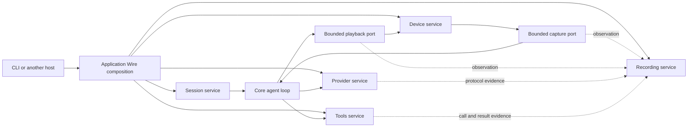

# Embeddable agent runtime and enforced service boundaries

Status: implementation in progress, 2026-09-05. This document specifies the target and acceptance criteria; the complete extraction and enforcement gates are not yet delivered.

This extends [the audio/device design](audio-subsystem-device-gateway-design.md). The service-local structure below supersedes that document's shared `services/internal` implementation layout. Audio ownership, buffered loop/device isolation, correlated evidence, and replay acceptance remain required.

## Checkpoint policy

Local checkpoint commits preserve the in-progress migration and are not release approvals. Commit messages must distinguish focused checks from aggregate acceptance. As of the 2026-09-05 checkpoint, full CLI integration still fails (including recording fixture composition, duration/cancellation, and shipped-process conversation cases), and architecture size violations remain. Continue with small commits per coherent repair; merge only after the required aggregate checks pass.

## 1. Decisions and reference

Build a `go-agent-runtime` module that an application can embed to construct and operate complete agent sessions. Keep `go-agent-loop` as the execution engine. The CLI becomes a host that translates configuration and input, invokes services, and renders structured output.

Each service owns `services/<name>/internal/` and `services/<name>/wire/`. Application composition injects each service as a whole. A shared `services/internal/` directory is not the target: it gives implementations a common visibility scope rather than a boundary per owner.

The reference inspected was the local `~/infinite-you` checkout, particularly:

- `pkg/services/factory_sessions/service_contracts.go` and `wire/wire.go`: owner-root contracts and service-local construction.
- `pkg/services/models/wire/wire.go`: private components assembled behind a service construction boundary.
- `docs/internal/standards/code/general-backend-standards.md`: recursive service ownership, inert construction, package limits, and deletion-only debt baselines.
- `Makefile`: separate package file-count, structure, boundary, and runtime-construction gates.

Adopt those ownership principles, without copying every existing reference signature. Some reference constructors still name private implementation types and have very large argument lists. Our externally callable providers must expose public contracts only, and their dependency groups must describe a cohesive role.

There is one primary `Service` interface per service, with focused input ports and returned session handles where necessary. Do not force every observer, storage port, or session handle into that interface to satisfy an interface-count rule. Consumers may define narrower interfaces satisfied by the service. No second public implementation facade or service locator.

## 2. Starting point and migration inventory

The current libraries already separate audio and device ownership. A production import inventory found no workspace dependencies in `go-audio`, only audio dependencies in `go-device-gateway`, and no CLI/device-gateway imports in `go-agent-loop`.

At the start of this extraction, the complete application runtime remained CLI-internal. The private `agentruntime` package had 114 non-test Go files and approximately 43,480 physical lines, including comments and blank lines. Filename grouping attributes 33 files/14,156 lines to rooms and 10 files/4,867 lines to browser scenarios. These counts locate concentration, not defect rates.

| Existing responsibility | Target owner |
| --- | --- |
| `agent-cli/internal/agent/executor_run.go`, ask execution, reusable chat invocation | Runtime session service; CLI retains REPL editing and rendering |
| Private runtime planning, live sessions, duration/cancellation and tool continuation orchestration | Session service private planning, execution and lifecycle packages |
| Provider protocol implementations | Existing `go-llm-gateway` |
| Provider selection and configured session creation | Runtime provider service, delegating protocol work to gateway |
| Tool resolution, dynamic capabilities and browser lifecycle | Runtime tools service and private capability adapters |
| `session_room*`, `room_*`, `internal/room` | Rooms service; sample mixing primitives belong to `go-audio` |
| Correlated session recording, manifests, finalization | Recording service; PCM/trace primitives remain in `go-audio` |
| Canonical session replay and room replay coordination | Replay service consuming session/room contracts |
| Device registry selection and worker attachment | Device service over `go-device-gateway` |
| Browser scenarios, self-play and customer probes | Separate diagnostics service or test harness, according to whether shipped functionality requires it |
| Browser reconnect/selection policy currently under CLI transport | Tools service capability implementation |
| Config discovery, environment/flag precedence, terminal signals and output | CLI host adapters |

Move policy with its owner, not merely its filename. In particular, the existing session request's `*config.Config`, flag-presence bits, SIGINT marker, and output writers are not the new embedded API. Recordings may legitimately use a file destination, but a service must not discover the CLI's home-directory layout implicitly.

## 3. Target package shape

```text
go-agent-runtime/
  go.mod
  services/
    session/
      service.go                    Service and session lifecycle contracts
      request.go                    normalized values
      events.go                     structured events and terminal result
      ports.go                      narrow required dependencies
      wire/
        providers.go                public NewService / provider set
        wire.go                     private graph injector where useful
        wire_gen.go                 generated assembly
      internal/
        service/                    implementation of session.Service
        planning/
        execution/
        lifecycle/
    providers/                      same service/internal/wire pattern
    tools/                          same pattern; private browser adapters
    devices/                        same pattern; gateway lifecycle adapter
    rooms/                          same pattern; consumes session contracts
    recording/                      same pattern; owns session evidence
    replay/                         same pattern; consumes recorded edges
    diagnostics/                    shipped probes/scenarios, isolated

agent-cli/internal/
  transport/cli/                    Cobra, REPL, signals, presentation
  config/                           host-specific config translation
  wire/                             injects runtime services into commands
```

Service child directories are `internal`, `wire`, and optionally `transports`. A service-owned transport adapts that service's contract; it does not own policy and is not imported by the implementation. Generic CLI presentation remains in the CLI host.

Ordinary private helpers belong in focused implementation packages. Introduce a nested service only for an independently meaningful responsibility and lifecycle: `services/X/internal/services/Y/{service.go,internal/,wire/}`. Nested Y is private to X and follows the same rules. Avoid turning every helper into a service, or recreating a broad `common`, `utils`, `manager`, or `core` package.

### Import and composition rules

1. Services consume peer root contracts. They do not import peer `internal`, `wire`, or `transports` packages. Go enforces sibling `internal` protection; the architecture gate also protects the other edges.
2. Service roots contain contracts, typed values/errors, and small value methods. No implementation aliases, concrete implementation imports, exported constructors, network/filesystem work, or dependency lookup.
3. Only composition packages import service `wire` packages. `X/wire` may import X's internals and private nested service wiring. Peer services are supplied as public interfaces by outer composition, not constructed inside X.
4. Exported provider signatures, aliases, generic arguments, and reachable public field/method types must not leak internal implementation types. Wire-visible `NewService` returns the public service contract.
5. The runtime module never imports `agent-cli`. Lower libraries never import the runtime module. Loop code never imports devices or provider-specific adapters. Audio maintains its existing independence.
6. Hosts compose the explicit service roles through their generated Wire boundaries. Do not pass that graph into service implementations as a general dependency bag. Add a module-level convenience entrypoint only when a real consumer requires a cohesive lifecycle spanning those roles.
7. Headless session packages must work without a device backend. Device composition is optional and explicit; an external text-only host must not be forced to initialize audio hardware.

### Decision ledger

| Decision | Reason | Enforcement / acceptance |
| --- | --- | --- |
| Keep `go-agent-loop`; add `go-agent-runtime` above it | The loop is reusable execution machinery; session construction and lifecycle are application behavior that other hosts also need. | Independent consumer builds with `GOWORK=off`; runtime cannot import CLI; lower libraries cannot import runtime. |
| Root contracts, `services/X/internal`, `services/X/wire` | Each service has a private implementation scope and can be replaced or injected as a whole. | Go visibility plus recursive service/import/type-leak gates; regenerate every registered Wire graph. |
| Inject inert services, allocate invocation state at start | Concurrent hosts must not share mutable session state; command construction must not open devices or providers. | Constructor side-effect, admission-copy, concurrent-host and partial-start cleanup tests. |
| Centralize PCM parsing, DSP and scheduling in `go-audio` | Debugging needs one implementation of sample arithmetic, framing and clock behavior. | Reverse-dependency/import gates, golden PCM tests, streaming continuity and virtual-clock tests. |
| Separate bounded data ports from control and presentation | Device stalls and slow output must not block a core tick or silently lose interruption commands. | Saturation, cancellation, control ordering, exact-tail and worker-join regressions. |
| Record each observed boundary truthfully | Enqueue, provider send, device consumption and physical audibility are different observations. | Correlated sample ranges and receipts; missing taps and overflow mark evidence incomplete. |
| Preserve behavior while deleting former owners | Moving filenames can leave duplicate policy and misleading test coverage. | Migrate original assertions through public contracts before deleting legacy implementations and fixtures. |

## 4. Construction, lifecycle and data flow

Wire constructs process-scoped, inert services once. Service-local providers assemble their private graph, and outer Wire binds service interfaces. Use generated injectors for substantial private graphs; do not create an alternate handwritten application graph beside Wire. The existing pinned Wire toolchain and generation checks extend to every injector.

Construction validates dependencies but starts no device, network session, goroutine, browser, or subprocess. Service methods create invocation-scoped resources through injected typed factories. These factories are lifecycle operations owned by an injected service, not callbacks that rebuild the application graph.

The session owner starts, cancels, drains, closes and joins its invocation resources, including cleanup after partial startup. Devices own device workers; tools own capability resources; recording owns the recorder drain/finalize. Each returned handle documents ownership and close semantics. Process shutdown cancels active sessions and joins them before closing shared resources. Concurrent sessions must not share mutable invocation options, cancellation markers, buffer epochs or recording state.

The embedded API accepts normalized model/session policy, content, capability roles, and optional audio ports. Provider credentials and host config discovery enter through explicit provider configuration/edges. The CLI handles flags and signal translation; the runtime sees typed cancellation causes. Domain filesystem authorization remains a tools responsibility even when the host resolves paths.

Output is a typed event stream plus a typed terminal result. Human announcements are rendered by the host. PCM uses separate bounded media ports, never a formatted text writer. Define event ordering, buffer ownership, capacity, overflow behavior, cancellation and terminal-delivery guarantees. A slow observer cannot silently stall an audio tick; evidence loss must mark the recording incomplete. Avoid a new unbounded event bus.



This diagram specifies the target ownership and data flow, not a claim that all recording taps have already migrated. Application Wire shares the canonical clock and injects each service as a whole. Provider I/O and device I/O run in their owning workers; the diagram's loop edges represent buffered admission, not blocking backend calls inside a tick.

The loop never calls a device, network backend or blocking recorder during a tick. Preserve the single ordered audio/control admission path, interruption epochs and actual consumed-sample timing. Session policy and tests use the canonical injected clock. Native I/O watchdogs may use host time only inside a named external-effect boundary; replay must distinguish those deadlines from recorded logical time.

## 5. Implementation sequence and exit criteria

Each phase delivers a usable build and updates the ownership inventory. Preserve behavior through production entrypoints, remove obsolete paths as they are replaced, and avoid indefinite forwarding aliases.

| Phase | Change | Required evidence |
| --- | --- | --- |
| P0: inventory and guardrails | Inventory production/test imports, public type leaks, file/function/package metrics, constructors and side effects. Add architecture policy and exact debt baseline. | Gate fixtures prove new violations fail and reductions/stale entries are detected. Existing checks remain green. |
| P1: embedded vertical slice | Add module and session/provider contracts with per-service Wire; extract one-shot text execution as well as minimal live session execution. CLI calls this same slice. | Separate consumer module with `GOWORK=off` runs fake-provider text sessions without CLI imports, config directory or terminal. Construction has no effects. |
| P2: buffered audio session | Move session planning/lifecycle and device attachment into their owners. Replace CLI options with normalized requests and typed outputs. | External host injects capture/playback buffers; exact PCM, ordering, barge-in, cancellation, failure propagation and cleanup tests pass. |
| P3: capabilities and evidence | Extract tool/browser policy, recording and replay; inject them through owning services. | Exact-once tool continuation; active-response ordering; bounded capture; strict offline replay and missing/incomplete evidence rejection. |
| P4: rooms and diagnostics | Extract room coordination through session contracts. Relocate browser scenarios/self-play/probes. | Multi-session isolation, room replay, mixer continuity, and customer diagnostic scenarios pass through public services. Production does not import testkit. |
| P5: finish the host boundary | Migrate remaining ask/chat/media paths, remove legacy runtime and construction aliases, reduce CLI to translation/rendering. | CLI/embedded parity, independent module build, platform compile matrix, Wire drift check, all moved packages baseline-free. |

The external consumer test has its own module and explicit local replacements for checkout builds; it must not rely on workspace visibility or `servicetest` aliases. Separately test released module resolution when versions are published. Test two hosts with different configurations concurrently to expose hidden globals.

Live Realtime testing remains a targeted final compatibility check, with credentials supplied only through the environment. Deterministic replay, not live model wording, is the normal CI oracle. Retain tests for clipped/missing playback, actual underflow silence, barge-in during tool activity, tool timeout/continuation, and long-session queue/memory/latency measurements. These tests do not claim to reproduce physical hardware scheduling.

Evidence acceptance must distinguish captured silence, no captured samples, and silence inserted to align a mixed timeline. Empty source recordings contain zero samples; unavailable or dropped observations are explicit metadata, never synthetic PCM used to satisfy a validator. A missing provider trace must remain missing and make the bundle incomplete; finalization must never replace it with a synthetic empty trace. Preserve monotonic clock values for elapsed calculations and convert to UTC only when serializing wall time. One observation captures its clock once. Recorder queues have both item and sample/byte bounds, report overflow as incomplete evidence, and drain independently of audio pacing. Constructor failure and finalization tests verify worker/resource cleanup. Long-session tests exercise chronological accumulation to catch quadratic copying, overlap overflow, and loss of an already recorded tail during finalization.

Raw provider capture and paced transport replay must use that same clock domain. The provider composition now accepts a canonical `clock.TimerSource`; raw WebSocket/stream capture retains its monotonic origin and serializes UTC metadata, while replay waits use injected timers. Legacy constructors retain a canonical real-clock default. Hosts that use virtual time must explicitly inject the same source into provider, session, room and device construction. A deterministic regression verifies an event at 25 ms remains blocked at 24 ms and is released by the next clock advance. Provider capture lifecycle tests also cover failed admission, invalid sessions, exactly-once finalization and persistence error identity. The gateway's historical `pkg/testing` placement for production capture/replay remains an ownership cleanup item; injecting clocks alone does not resolve that placement or establish bounded capture memory.

## 6. Enforced shape and complexity policy

At the starting revision, `.golangci.yml` enabled only `funlen`, `gocognit`, and a revive file-length rule, with ceilings of 296 function lines, 124 cognitive complexity, and 1,307 file lines; it excluded tests. The working implementation now enables the correctness, literal, global-state and suppression checks below, including tests. Separate Make targets retain vet, Staticcheck, pinned analyzer resolution, builds and Wire drift checks. The architecture gate supplies the stricter per-symbol budgets without raising global ceilings to accommodate old code.

The [size-baseline documentation](size-baselines.md) now describes the maintained-module inventory, pinned analyzer versions, stronger budgets, and exact historical debt. Its former three-module inventory and maximum-holder paths were stale; P0 uses fresh source measurements rather than treating those holders as current. Existing AST import tests in CLI and agent-loop protect selected audio/device boundaries. Port their invariants into the general gate with negative fixtures before retiring redundant tests; checking only the old `/services/internal/` string would miss the new layout.

The checked-in architecture policy applies the limits below to new/extracted packages. Historical exceptions are measured individually and may only shrink. These are reviewable engineering budgets, not claims that a metric proves good design.

| Measure | Blocking target | Measurement / treatment |
| --- | --- | --- |
| Files per package directory | 15 handwritten Go files, including tests | Count all platform variants and both local/external tests in that directory once; exclude verified generated/vendor/fixture code. Mirrors the reference policy. |
| Production file length | 400 physical lines | Include comments and blanks; do not incentivize removing documentation. |
| Test file length | 600 physical lines | Split scenarios by behavior; do not delete coverage to satisfy file count. |
| Function length | 80 physical lines; 50 statements | Include nested literal bodies; count literals independently for complexity too. Test functions initially allow 120 lines/80 statements. |
| Cognitive complexity | 15 production; 20 tests | `gocognit`; baseline exact legacy symbols. |
| Cyclomatic complexity | 15 production; 20 tests | `gocyclo`; complements nesting-sensitive cognitive complexity. |
| Root service API breadth | Report >8 service methods or >12 request fields | Review signal initially; distinguish input ports/handles from service facades. Do not hide fields in maps or arbitrary bags. |
| Package/service aggregate size and dependencies | Report totals and dependency graph each PR | Prevent cosmetic file/package splitting; establish additional hard budgets only from measured responsibility boundaries. |

The file gate covers all maintained Go modules, including tooling. Package size applies to maintained library/service/transport/test packages. Generated files are excluded only when a recognized generated header and a registered reproducible generator agree; a filename alone is insufficient. Embedded executable fixture generators remain maintained code even under `testdata`. The `wire-business-method` rule rejects production exported methods on concrete receivers in service Wire packages: constructors/provider functions and contract interfaces remain allowed, while behavior belongs under the owning `internal`. No broad exclusion for `wire`, adapters, tests, or native backends; real exceptions are exact and explained.

### Static rules

| Rule group | Enforcement plan |
| --- | --- |
| Compile correctness | Build/typecheck every module, Go `internal` and cycle checks, interface implementation assertions, Linux/Windows portable builds and native macOS audio build. |
| Ownership and public surface | AST/package-graph gate for approved module/service families, recursive service shape, forbidden imports, public type reachability, and root contract purity. Apply to tests and support packages as well as production. |
| DI and effects | Forbid peer Wire use outside composition, service locators and root implementation aliases. Type-aware checks for direct environment/terminal/clock/process/network use outside approved adapters. Constructor side-effect tests cover behavior static rules cannot prove. |
| Correctness analyzers | Retain vet/Staticcheck; the working configuration enables `errcheck`, `ineffassign`, `unused`, `nilerr`, `errorlint`, `bodyclose`, `contextcheck`, and `durationcheck`. Avoid duplicate output where vet/Staticcheck overlap. |
| Explicit policy values | The working configuration enables `goconst` for repeated meaningful literals, `mnd` for unnamed numeric policy values, and `exhaustive` for owned lifecycle/control states. |
| Global state and initialization | `gochecknoglobals`/`gochecknoinits` where practical, plus precise exceptions for sentinel errors, compile-time interface assertions, immutable lookup data, generated Wire sets and required backend registration. Mutable registries/caches/config belong to injected owners. |
| Imports and prohibited calls | `forbidigo` handles selected prohibited calls; the custom type-aware architecture gate handles dependency direction, aliases, public-type leaks and owner-sensitive rules. The central architecture manifest is authoritative. |
| Suppressions | `nolintlint` requires a named rule and explanation, disallows unused suppressions; architecture exemptions live in the reviewed policy manifest, not blanket comments. |

“Const preventers” is interpreted here as protection against magic policy values, duplicated literals, and mutable globals. Constants themselves are useful. Timeouts, retry counts, queue budgets and protocol statuses should be named and owned near their policy. Do not create a repository-wide constants package, merge unrelated values because they happen to be equal, or turn every test literal into a shared constant. Go cannot make a map/slice deeply immutable: hiding mutable data behind an accessor must return safe copies or otherwise enforce ownership. Required configuration is not replaced by a fixed constant.

Use the repository-pinned analyzer versions, not an unpinned latest install. Confirm each proposed linter and setting against that binary (`linters` and config validation) before committing executable config. Current upstream references: [linter catalog](https://golangci-lint.run/docs/linters/) and [settings](https://golangci-lint.run/docs/linters/configuration/). Tool availability does not justify enabling every stylistic linter; prefer checks with actionable findings.

## 7. Gate implementation and debt rollout

Add a small `tools/architecturegate` Go module using AST/type information and `go/packages`, with a checked-in ownership/rule manifest. File inventory includes inactive platform files; type checks run over the supported build matrix. Fail on loading errors, missing modules or an empty package selection. Import aliases, dot imports, generics, exported aliases and test support cannot bypass ownership checks.

Use `go/analysis` for package-local semantic rules and a graph/inventory driver for cross-package and directory rules. Maintain positive and negative fixtures with [analysistest](https://pkg.go.dev/golang.org/x/tools/go/analysis/analysistest), plus gate CLI tests for inventory and baseline behavior. The [analysis API](https://pkg.go.dev/golang.org/x/tools/go/analysis) supplies syntax and type information; it does not prove arbitrary side-effect freedom or bounded execution.

Implemented command entrypoints (their existence does not imply the complete repository currently passes):

```text
make architecture-check       ownership, service shape, public API, DI boundaries
make size-check               package/files/functions and exact legacy baseline
make lint                     existing analyzer gate plus approved new checks
make wire-check               every registered injector, generated diff clean
make embed-check              independent external consumer and host parity
make verify-architecture      architecture, size, gate fixtures and Wire drift
```

Extend existing Make/CI infrastructure rather than introducing a second analyzer installer. Fast PR checks cover formatting, compilation, architecture, size, analyzers and generated drift; required CI also retains behavioral/race/replay/platform tests. The final aggregate must run full ownership checks, even when local commands offer changed-package optimization. CI rejects skip flags for required gates.

Baseline rules:

1. P0 records exact existing violations: rule, owner, package/file/symbol or import edge, measured ceiling, rationale and migration phase. No blanket directory or module allowance.
2. New violations and metric increases fail. A reduction must lower its recorded ceiling; resolution must remove the entry. Stale entries fail.
3. Compare the baseline with the merge base so increasing a number or adding an entry cannot silently approve itself. No automatic “accept current” step in CI.
4. Renames require an explicit one-to-one migration mapping; splitting legacy code cannot multiply exemptions. New/extracted destination packages must meet the target limits before their phase closes.
5. Migration debt converges to zero. A real structural exception (for example a native ABI table) is separately reviewed with exact scope and justification; it is not disguised as permanent baseline debt.
6. Rule/config changes are visible reviewed policy changes. Report counts by owner and phase in CI artifacts so debt reduction is measurable.

Analyzer fixtures must cover sibling-internal imports, cross-service Wire imports, implementation type aliases, transitive public type leaks, tests importing private implementations, generated-file spoofing, platform-only violations, missing modules, baseline growth/staleness and renamed debt. Include valid small services with ports and session handles to avoid enforcing an artificial one-interface-only model.

## 8. Completion criteria and limits

The refactor is complete when another Go host runs text, buffered audio, tools, recording and supported replay through public runtime services; the CLI uses the same services; each service owns its internals and Wire boundary; moved code meets the new gates without legacy exemptions; and existing regression/platform evidence remains green. Shipped diagnostics and rooms must be migrated before declaring the CLI extraction complete.

Compile-time and static gates protect shape, dependencies and many correctness mistakes. They cannot establish DSP quality, deadlock freedom, bounded callback latency, cleanup correctness, customer-perceived audibility or semantic equivalence. Keep race, deterministic-clock, buffer/PCM, replay, lifecycle and long-session resource tests alongside the static rules. A successful refactor must reduce coupling and preserve those behaviors, not merely make files smaller.

### Current verification checkpoint

This is an intermediate working-tree checkpoint, not completion or merge approval. The actual CLI uses public runtime services for one-shot execution, persistence and ordinary live finite-media sessions. Eight registered generated graphs cover CLI composition and runtime devices, providers, recording, session, rooms, tools and replay. The unused module-root `TextRuntime` wrapper was deleted: public service contracts and their Wire constructors are the embedding entrypoints. An additional `agent-core` facade would duplicate those responsibilities.

| Owner | Implemented and verified | Remaining acceptance |
| --- | --- | --- |
| Session execution | One-shot and iterative execution extracted; scoped shape/lint checks pass without destination debt. Original completion/failure/resume assertions retained; actual inference receives iteration annotations. | Finish live lifecycle migration and remove legacy dispatch. Interactive trace/resume/steering policy now uses the session service; final callback/CLI parity checks remain. Historical skipped tool-result contracts remain gaps. |
| Persistence | Canonical context-aware `FileStoreFactory`/`ManagedStore`, generated injector and actual CLI injection. Old CLI store deleted. Original filesystem/list/trace/error assertions retained; inline image/audio/video/file bytes round-trip. Coverage 89.2%, enforced floor 85%. | Final aggregate regression and analyzer checks after integration. |
| Providers | Explicit configuration/credentials, injected clock, HTTP and raw session capture/replay. All eight original HTTP transport assertions retained. Actual CLI streaming/final record/replay acceptance passes with the race detector. Private implementation coverage is tracked separately from recording lifecycle. | Production raw capture still lives in gateway `pkg/testing`; bounded long-session capture ownership remains unresolved. |
| Replay | Public admission/planning service; strict transport checks actual runtime tool results rather than injecting recorded tool outputs. Exact short PCM and corruption/orphan rejection tests pass. Coverage 82.8%, floor 80%. | Strict replay of the live 368-record fixture now completes offline with byte-identical output. Final read-image/tool continuation parity remains an aggregate acceptance check. |
| Audio/devices | Canonical analysis/mixing, buffered media ports, exact short response tails, pacing and cleanup tests. Zero captured samples stay zero; missing traces are not synthesized. | Live CLI output now preserves the negotiated 24 kHz format; complete legacy RTC/media migration remains. |
| Rooms/tools | Public service contracts and private implementations; room latency facade moved behind a public interface. CLI tool registry/implementations substantially retired. | Finish room duplicate-owner deletion, capability scope parity and strict destination gates. |
| CLI/diagnostics | Typed output presentation restored, including JSON/binary/refusal routing and writer errors; host resolves prompt/config/path values. Ordinary live sessions, directory recording/replay and scheduled finite audio use the public runtime. | WebRTC remains unavailable by its existing contract. Diagnostic/self-play paths, semantic replay and remaining legacy runtime retirement still require work. |

A 2026-09-05 working-tree inventory snapshot finds 107 production Go files / 41,353 physical lines in legacy CLI `agentruntime`, 15 files / 1,871 lines in CLI `internal/tools`, and 192 files / 32,651 lines under runtime services. Counts exclude tests and generated injectors but include comments and blank lines. They locate remaining concentrations; they are not a defect rate or completion percentage. Production callers and regression assertions must move before duplicate owners are removed.

The independent `tests/embedding` module runs with `GOWORK=off` and tests public contracts/Wire without CLI or private implementation imports. It covers inert construction, independent concurrent hosts, literal prompts, retained history, cancellation/error identity, bounded media ports, exact PCM tails, injected timestamps, commit ordering, capture finalization, tool capabilities and room evidence rejection. Focused checks and a complete runtime race run have passed at intermediate checkpoints; changes made afterward still require final aggregate verification.

The full audit before ongoing lifecycle/evidence cleanup reported 136 findings across 172 packages, 1,790 files and 25,352 functions, including 41 historical metric increases. Mutable-global and stale-baseline findings were zero at that checkpoint. These numbers are a dated diagnostic snapshot: subsequent reductions require a fresh final report. Findings were concentrated in live session contracts/implementation and room evidence/lifecycle. Extracted execution, persistence, provider, replay and one-shot service packages passed their scoped checks without destination baselines. Full-repository lint, historical-baseline pruning, all-platform compilation and eight-graph generation drift checks remain required.

A bounded live `gpt-realtime-2.1` run through the CLI audio-file path completed with provider-authored completion. After correcting output format selection and terminal-tool admission, verification matched all 398,250 input PCM bytes and 422,400 output PCM bytes, wrote a 24 kHz WAV and advertised zero tools. The same 368-record raw capture then replayed through the CLI with credentials removed, completed successfully, and produced byte-for-byte identical 24 kHz PCM. Replay preserves interleaved provider/client ordering and waits for provider control queue capacity with cancellation rather than dropping a commit under saturation. Regression tests cover queue release, cancellation, close, and strict payload validation after pacing. This run used files, so it does not establish microphone/speaker parity or physical scheduling reproduction.

The recording service owns capture-session admission/finalization in `internal/service` and directory spooling/publication in `internal/evidence`, behind the same generated injector. The canonical clock is injected through Wire. Capture lifecycle coverage is 95.6% with a 90% floor; directory evidence coverage is 85.6% with an 80% floor. Its scoped shape and pinned lint checks pass without destination debt.

Directory admission never shares a filesystem-write lock with the drain worker. The queue has item and byte budgets, counts the active item against its byte budget, owns admitted payloads, and latches overflow as incomplete evidence. Two append-only PCM spools avoid creating a file for every media quantum. Frame records retain observed timestamp, byte offset, sample count, format, sequence, epoch and response identity; conversation entries retain turn byte ranges and tool call/result correlation. Runtime message, media and lifecycle observations have explicit `runtime-*` stream labels rather than claiming to be raw WebSocket or physical-device observations. Missing timestamps, invalid formats, dropped observations, missing terminal or raw provider evidence, and writer failures cannot produce a complete status. Lifecycle evidence and presentation share source sequence identifiers; overflow records include both rejected and evicted observations. A replaced destination claim is not removed by the old owner. Race tests exercise blocked disk admission, mutation after admission, exact tails/offsets, failure identity, missing evidence and cleanup. Injected recorder failures are latched and returned at lifecycle completion; they do not cancel healthy audio simply because observation failed. Failure on the terminal observation itself also updates the delivered terminal and Wait result. Unknown semantic message types preserve their original serialized payload and later PCM while marking the convenience projection incomplete.

Directory finalization now joins a completed raw provider capture as `provider.json`, streaming the source and validating its digest without retaining a second capture-sized buffer. Missing raw evidence still publishes available semantic/PCM evidence with partial status and an error; it never fabricates a provider trace. The original integrity envelope is preserved, and configured redaction that would alter a protected capture prevents unsafe publication. Automatic CLI capture-path composition now passes a full offline run using the verified live capture: the portable archive contains all 368 raw records, exactly 398,250 input PCM bytes and 422,400 output PCM bytes, with no partial status; output matches the original 24 kHz live WAV byte for byte. Public directory replay admission is implemented and its end-to-end CLI check succeeds without credentials: replaying the portable directory produces the same 422,400 PCM bytes at 24 kHz. Admission rejects partial status and mismatched provider-artifact digests; path/cancellation hardening and aggregate regression checks are still underway. Physical device observations, shared room/session schema, retained-history memory bounds, shipped diagnostic/room parity, a thin CLI and baseline-free destination packages remain exit criteria.


The one-shot CLI handler now delegates invocation work through the session contract and delegates text/JSON/binary/refusal rendering to the CLI output package. The original presentation matrix remains an actual-command acceptance test; diagnostic writer failures are checked in final and streaming modes. Host resolution uses the selected workspace for relative allowed paths, retaining the caller's original flag values. These changes reduce command concentration without putting terminal formatting into the embedded runtime.


HTTP capture no longer reads an entire response before returning headers to the provider. Its body wrapper records bytes as consumed, preserving streaming latency and forwarding read/close errors. Capture snapshots clone payloads and headers. Finalization rejects active bodies and known read/close failures rather than publishing those as complete evidence. The original injected-transport body assertion now consumes the body before inspecting the capture; its exact-byte/status assertions are retained. Request body read/close errors and transport failures now prevent publishing a complete capture. Credential-bearing HTTP headers are omitted from artifacts without changing live headers or correlation metadata. Provider/gateway race tests cover these cases. This fixes eager buffering on the response path; retained capture history is still memory-backed and must not be described as bounded archival storage.

### Additional boundary checks

The session service's private `input` package owns admission copies, including nested tool parameter schemas, rich content bytes, replay chunks and turn-detection pointers. The private `live/observations` adapter connects invocation messages/media/events to the public recorder contract; the recording service remains the archive/storage owner. These packages pass their scoped architecture and pinned analyzer checks. Focused race coverage is 100% for input (95% floor) and 87.1% for observations (85% floor). Malformed PCM and partially invalid format metadata remain observable errors; fallback decoding uses the canonical audio codec and does not duplicate a provider's media endpoint observations.

Raw WebSocket and normalized-session capture snapshots now copy their payload bytes, including legacy `Data`, so a consumer cannot mutate retained evidence or silently change its later digest. This ownership guarantee does not solve retained-history growth: archival streaming and bounded raw-history storage remain open work.

Core hot-loop pacing accepts the canonical `clock.TimerSource` through `agentloop.WithClock`. It measures elapsed tick work and waits in that same domain, with cancellation-aware waits. A deterministic hot-loop regression verifies no next tick at 24 ms, release at 25 ms, and cancellation without a further time advance. Manual ticks remain unpaced. Legacy CLI orchestration and several external-effect tool/device waits still use host time; the general timing consolidation is not complete merely because live session policy uses an injected scheduler.

Public browser capability tests now cover shared-target participants with separate owners, concurrent invocation identities/receipts, target selection and refresh isolated to one participant, and surviving-participant execution after another closes. The old hermetic browser regression is retained for broker-specific pending/wait queues, discovery/configuration and cross-broker receipt isolation not yet covered through a public replacement. Duplicate tests are retired only after their assertions have an appropriate owner.

Complete `GOWORK=off go test -race ./...` runs for the runtime and independent embedding modules passed again after replay admission and room evidence changes. Runtime Staticcheck 2026.1 and regeneration of all eight Wire graphs also pass at this checkpoint. Subsequent concurrent CLI edits still require a final aggregate run. The legacy long-output CLI fixture has passed three consecutive isolated runs with its original exact 810,400-sample assertion, but an earlier broad-run tail failure remains unexplained; isolated success does not close that reliability gap.

### Remaining migration work, in dependency order

1. **Stabilize the shared implementation.** Complete the current CLI host extraction, retain composition/preflight assertions through a valid public replay fixture, and obtain a fresh aggregate test and analyzer result. The latest complete CLI integration run (`GOWORK=off CGO_ENABLED=0 go test ./test/integration -json -count=1 -timeout 5m`) finished with failures in 282.392 seconds. It exposed remote device endpoint selection, duration/cancellation classification, missing typed incomplete-schedule outcomes, custom tool capability composition, replay divergence reporting, and recording fixtures that bypass provider construction. The earlier in-band provider close/join hang and composition fixture failures have focused regressions passing. Scheduled audio and plain-speech/turn-start recording fixtures now use the real provider service with an injected transport; their focused checks pass without weakening the original assertions. These are migration regressions to resolve through the intended public owners; focused green tests do not supersede them.
2. **Finish reusable policy ownership.** Move shipped self-play, probes and browser scenarios behind a diagnostics owner; move remaining semantic replay and legacy session orchestration behind the corresponding public services. Delete their former CLI owners only after production entrypoints and original assertions use the replacements.
3. **Join physical evidence.** Connect first-visible capture, provider input/output and callback-consumed render evidence into the portable recording contract. Preserve clock mappings, underflow silence, interruption epochs and unavailable-tap metadata. Runtime PCM observations alone cannot establish physical playback.
4. **Bound complete session retention.** Stream raw provider history and bound convenience conversation projections as well as recorder queues. Add increasing-duration tests for memory, latency and finalization cost; an individual bounded queue does not bound the complete session.
5. **Close parity and release gates.** Run independent embedding, CLI workflows, race/lifecycle/replay tests, platform builds, all registered Wire graphs, ownership/size gates and pinned analyzers on the same stable revision. Report unresolved customer symptoms and evidence limitations before declaring the migration complete.

The persistent-input contract deserves its own parity gate: an end-of-turn marker commits a turn and continues consuming the same source; it is neither a source failure nor end-of-session. Only finite inputs may opt into automatic completion after their expected responses. Current tool definitions also form an execution authorization boundary, including an explicitly empty set and dynamic refresh; advertising a filtered list to the provider is insufficient if the executor still accepts omitted tools.

Replay classification and metadata now belong to `replay.Service.InspectCapture`. An admitted-directory/provider-file handoff regression was exposed and corrected during integration. A freshly rebuilt CLI now replays the portable archive offline through `InspectCapture`, producing exactly the original 422,400 PCM bytes at 24 kHz. CLI transport consumes a typed admission result instead of opening gateway capture JSON. Live rendering belongs to the CLI output package; CLI-local host adapters may translate flags, paths and explicit provider configuration, but may not absorb replay policy or session lifecycle simply to reduce a command file's size.

Room evidence now resides under `services/rooms/internal/{evidence,manifest}` with the service's own Wire boundary. Scoped room/runtime ownership and size checks pass at the latest checkpoint. Latency evidence counts interleaved PCM samples once: stereo channel count affects frames/duration, not a second multiplication of byte count. Tests retain the exact byte/duration assertion and verify failed publication leaves no temporary artifact.

The Unreal comparison's five required contracts remain the high-level review checklist: lifecycle/readiness, render demand and total queue latency, applied control receipts, device-loss ownership, and explicit routing/tap topology. They fit these owners; additional broad services are unnecessary. Detailed subsystem snapshots and adaptive tuning can follow after these observable contracts are reliable. See [the comparison and its source links](audio-subsystem-device-gateway-design.md#13-unreal-engine-comparison-and-high-level-closure).

The live owner now reacts to `SESSION_CLOSE` for ordinary providers as well as replay: it publishes the terminal boundary, initiates cleanup and joins transport completion. The original injected-provider fixture passes without forcing it to close its own transport. EOF completion also reevaluates an already settled response, while pending response/control/tool work and an explicit provider-close requirement prevent premature termination. Focused race and lint checks cover these changes; the broader parity failures still require resolution.

A deterministic mixer regression reproduces Close winning after a cadence timer becomes ready but before mixing acquires its state lock. The previous implementation incorrectly retained `ErrClosed` as a runtime failure. Normal shutdown now exits without inventing that failure; other mixer errors remain observable. Mixer race tests and 20 repetitions of the affected room admission test pass after the fix.

Formatting, vet and Staticcheck targets now use the same maintained inventory as lint. Vet and Staticcheck run each module with `GOWORK=off`, so independent consumers and auxiliary tools cannot be skipped or fail merely because they are outside `go.work`. Vet passes across all 15 maintained modules at this checkpoint; final formatting and analyzer checks remain part of stabilization.

Checkpoint history: `449c935f` preserves the aggregate migration; `20c50614` moves scheduled recording fixtures through provider composition; `8134c2e6` does the same for plain-speech and turn-start barge-in; `35c243c7` lowers the corresponding measured debt. The integration package architecture gate passes across 108 files after these reductions. Independent runtime and embedding race suites passed again on the subsequent working tree. This evidence does not supersede the failing full CLI run or establish release readiness.

Checkpoint update: `f1624304` separates sealing provider input from draining queued audio, preserving exact partial-frame tails and closing the provider source once across concurrent shutdown paths. `a9dfd7c5` preserves independent and typed failures while translating expected duration exits at the CLI boundary. Focused close/seal race tests and duration-error identity tests pass. The subsequent session integration subset completed in 37.502 seconds with 32 passing tests/subtests and 11 failures; scheduled silence/negative-control behavior, replay diagnostics and configuration/output parity remain open. Concurrent physical-output/file composition, semantic sidecar and finite-session lifecycle changes are not covered by those committed checkpoints. Continue committing these as separate verified slices; none of these checkpoints establishes release readiness.
