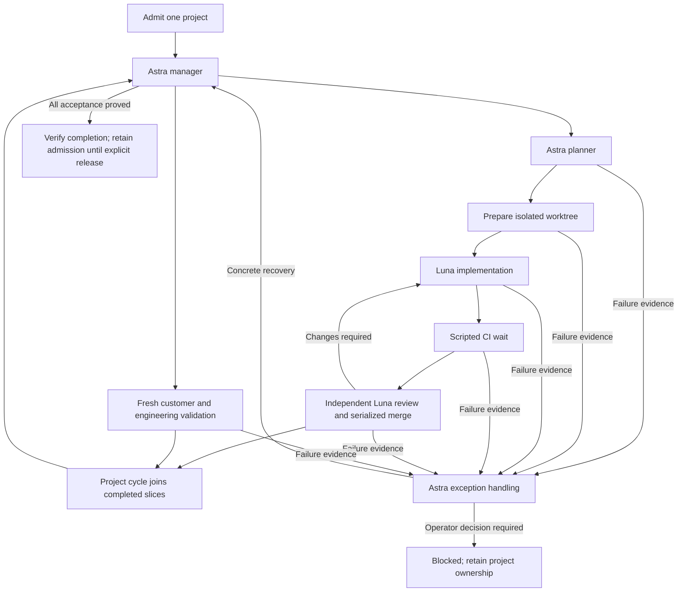

> Historical bootstrap design, superseded by overview.md and operating-policy.md.
> The separate project-cycle and reconciliation graph below is no longer active.

# Lightweight single-project factory handoff

Status: bootstrap implementation and recovery verification complete; live startup
evidence is recorded separately. The migration is not complete,
the baseline has not been merged, and this document does not authorize claiming
either outcome without the evidence below.

## Reference and decisions

The requested `~/work/infinite-you` directory is absent. The matching repository
is `~/work/you-agent-factory`, remote `portpowered/you-agent-factory`. This design
uses fetched main commit `a82f2e5a532a25b3e163014b28e72190ac28c354`
(September 5, 2026). The private runtime build uses this exact source revision.

Preserve its project cycle, deterministic workspace preparation and CI wait,
independent review, validation, failure feedback, loop breakers, and recovery
reconciliation. Do not copy its portfolio scheduling, host-specific port,
unrelated product standards, or acceptance waivers.

| Responsibility | Configuration | Reason |
| --- | --- | --- |
| Project leadership and escalation | One Astra medium manager profile; shared capacity 1 | One accountable decision maker with separate normal and exception entry points |
| Slice planning | Astra medium; shares manager capacity 1 | Planning stays aligned with project leadership |
| Implementation, review, validation | Luna max; shared capacity 2 | Bounded parallel throughput; independent review remains a separate dispatch |
| Workspace setup, CI wait, cycle classification, reconciliation | Python scripts | Waiting and mechanical state transitions consume no model session |
| Validation | Also takes exclusive validation capacity 1 | Avoid competing physical audio or live-session probes |
| Merge | Serialized, after independent review and required CI | Avoid invalidating another lane's integration proof |

Manager escalation may diagnose, narrow a next slice, repair a recoverable plan,
or propose a contract amendment. Only the operator can weaken project acceptance,
approve a new project, or expand paid validation beyond its admitted budget.
An unchanged failure must not trigger endless worker retries. Escalations name
the criterion, evidence, attempted correction, impact, and smallest decision.

## Execution graph

One running manager is insufficient to enforce one active project: projects
spend most of their lifetime waiting on children. Use a small durable admission
owner with atomic `Admit(projectID, contractRevision)` and
`Release(projectID, terminalEvidence)` operations. Store the owner under the
repository's shared Git directory, so separate checkouts use the same admission
record and interprocess lock. Preserve ownership through waiting, validation,
restart, and blocked states. Repeating admission for the same project is
idempotent; a different project is rejected. A crash or elapsed lease age never
releases ownership automatically. Before resume, reconcile the recorded session
and project against canonical runtime state; uncertainty fails closed.

Keep this record limited to admission identity, contract revision, session, and
release evidence. Child task scheduling stays entirely in the factory runtime.
The supported launcher and project submission path must enforce admission;
manager prompts alone are insufficient. Prevent a second launcher from opening
another project session, and reject cross-project child packets before dispatch.
Test those boundaries rather than treating a local lock file as sufficient.

The reference's workstation resources return capacity after a dispatch and
therefore cannot represent project ownership. Its multi-input matching is atomic,
but same-type output propagation preserves that input's identity: a free-slot
input does not automatically become a same-name slot owned by the admitted
project. A graph permit would require additional verified identity transfer and
restart/idempotency behavior. The durable admission owner keeps this invariant
explicit without modifying the factory engine for our bootstrap.

Bootstrap must also reconcile prompt/script contracts. In the pinned reference,
`prepare-validation.py` calls the mandatory `factory-preflight.v1` validator,
while the manager's example mission omits `preflight`. Our emitted packet must
carry the project identity, contract revision, hashed source plan/request/
acceptance, and intended mainline expected by preparation. The harness uses a smaller versioned manifest plus exact packet identity, immutable
authority hashes and artifact hashes. Preparation tests cover wrong hashes, stale
authority and incomplete criteria. Workspace setup fetches current main; the recorded
mainline SHA is a handoff observation, not a stale-main waiver.

Routine meta planning is scheduled every four hours. Project progress and immediate
exception routes are independent of this cadence.

No autonomous portfolio generation. The manager works only on the admitted
project. A blocked project retains admission until explicitly resolved; it does
not silently admit a second project. Recovery reconciles canonical Work and
Factory Events; Markdown memory must not become a second scheduler.

## Handoff sequence

1. Finish and checkpoint the three current bounded slices: runtime device probe,
   whole tool-service injection, and bounded raw provider recording. Freeze new
   extraction work until the handoff is reproducible.
2. Prove the bootstrap graph with the installed runtime: configuration loading,
   one-project admission, failure feedback, CI-before-review, review rejection,
   blocked ownership, restart recovery, and separate validation outcomes.
3. Pin the baseline commit, freshly fetched main commit, tool/runtime version,
   commands and results, known failures, and rollback point in a handoff manifest.
   Start from a clean committed tree; never give a worker an implicit working-tree
   snapshot as the baseline.
4. Admit one immutable migration project. Its first Luna max implementation task
   integrates the pinned baseline with current main in an isolated branch. Resolve
   conflicts, preserve both sides' behavior, and run the declared readiness gates.
   A separate Luna max reviewer checks the result and required CI before merge.
5. The Astra manager continues the remaining migration from the merged baseline.
   A baseline merge completes one integration slice, not the whole project.
6. Transfer active ownership only after a bounded real factory dispatch and its
   recovery path have been observed. Record the actual isolated server address,
   session, project, artifact identities, and resume procedure.

Do not attach to the reference factory's port 7437 or replace a running factory
definition. Use a dedicated explicit endpoint and verify its project ownership.

## Baseline readiness and remaining project acceptance

Baseline readiness requires compilation and affected behavior tests, generated
Wire consistency, applicable architecture/lint gates without baseline growth,
independent review, and an explicit account of remaining gaps. A known failure
cannot be called green. Distinguish a reproduced pre-existing failure from a
regression introduced by the baseline; unresolved regressions prevent merge.

The immutable project contract must retain these outcomes:

- `AUDIO`: One independently testable audio subsystem owns packet parsing,
  formats, clocks, sample timing, DSP, and buffer operations. The core loop uses
  buffers and never accesses physical devices directly.
- `DEVICE`: The adjacent device gateway owns device abstractions and lifecycle.
  Device output evidence records consumption, not only queue admission.
- `EMBED`: The runtime can be constructed and exercised from another Go module
  without CLI imports, flags, terminal state, or hidden global initialization.
- `SERVICE`: Thin `services/X` contracts, private `services/X/internal`
  implementations, and independently injectable `services/X/wire` construction.
  CLI transport delegates business behavior to those services.
- `TRACE`: Correlated device capture, device playback, provider send/receive,
  tool lifecycle, cancellation, queue/drop, and session terminal evidence use
  explicit timing domains and bounded recording resources.
- `REPLAY`: Credential-free replay reproduces recorded packet ordering, audio,
  tools, interruptions, and termination, with explicit limits for hardware and
  external nondeterminism. No claim that a software replay proves acoustic output.
- `FAILURES`: Characterize truncated/no playback, barge-in, long conversation
  slowdown, and tool-continuation/active-response collisions. Fix what can be
  demonstrated and preserve exact residual limitations and reproductions.
- `QUALITY`: Enforce package/file/function size, complexity, dependency boundaries,
  mutable-global policy, generation consistency, and relevant compile/static/race
  checks. Move debt down; do not enlarge a baseline to pass a migration.
- `PARITY`: Preserve supported CLI behavior and prove integrated behavior on the
  final artifact, including authorized bounded live Realtime validation and
  separate fresh customer and engineering reports.

Current known unfinished areas include substantial legacy CLI runtime logic,
remaining shared internal service ownership, physical four-plane evidence,
bounded conversation projections, complete canonical clock coverage, and full
CLI/integration parity. Existing focused tests and previous live replay are
useful evidence but do not prove this entire contract.

## Acceptance evidence and rollback

Every slice records its criterion IDs, owned packages, shared-surface owner,
exact checks, observed result, and unproven edges. Dependency edges express
semantic prerequisites; no concurrent workers own the same composition surface.
Customer and engineering validation are separate fresh missions against a pinned
artifact; either failing keeps project acceptance open.

Keep checkpoint commits for bounded changes. Freeze a reviewed baseline SHA
before handoff, preserve its branch, and integrate through a separate branch.
Rollback uses a revert of the offending integration or a new recovery branch
from a recorded checkpoint; never discard unrelated working-tree changes or
rewrite shared main. Stop dispatch before replacing a live graph, preserve its
recording, and verify resumed canonical state before issuing replacement work.
